# STM32 FreeRTOS Serial Manager

基于 `STM32F103C8T6`、STM32 HAL 和 FreeRTOS 的二进制串口命令服务。固件通过 USART1 的 Receive-to-IDLE DMA 接收字节流，完成缓存、组帧、CRC 校验、任务间传递、命令分发和状态响应；仓库同时提供 Python 串口验证脚本以及可在 PC 上编译的 Ring Buffer、Parser 和 CRC 测试。

本项目适合用于理解或验证以下最小闭环：

- STM32 UART Normal DMA + IDLE 不定长接收；
- 流式二进制协议解析与 CRC 完整性校验；
- FreeRTOS Queue 隔离通信任务与设备任务；
- PC 向 MCU 设置状态、读取状态并验证请求/响应一致性。

当前实现是一个范围明确的小型命令服务，不是通用串口协议框架。使用前请先阅读“已知限制”和“许可证”。

## 实现状态

| 能力 | 状态 | 当前行为 |
| --- | --- | --- |
| USART1 RX DMA + IDLE | 已实现 | DMA1 Channel 5，Normal mode，128-byte DMA Buffer |
| Ring Buffer、Parser、CRC | 已实现 | 256-byte Ring Buffer；`DATA` 最大 32 bytes；CRC-16/CCITT-FALSE |
| FreeRTOS 任务间传递 | 已实现 | `ProtocolQueue` 深度为 8，`ProtocolFrame_t` 按值、非阻塞入队 |
| `CMD_PING` | 已实现 | 返回空负载的 `CMD_PING_RESP` |
| `CMD_SET_MODE` / `CMD_GET_STATUS` | 已实现 | 设置和读取 `DeviceState_t.mode` |
| 业务错误响应 | 已实现 | 处理 `CMD_SET_MODE` / `CMD_GET_STATUS` 的非法长度、非法模式和未知命令 |
| 协议统计读取 | 尚未提供 | 代码中存在内部运行计数器，但没有协议读取入口；`CMD_GET_STATS` 尚未定义，不是当前有效命令 |
| Python 串口验证 | 脚本已提供 | 覆盖 SET → GET、错误响应和接收边界；仓库未保存具体硬件的通过记录 |
| 固件构建 | 工程已提供 | 使用提交的 Keil µVision `.uvprojx` 工程 |
| 烧录配置 | 部分提供 | SWD 引脚已配置；具体探针和有效 Flash Algorithm 需用户本地设置 |

“已实现”表示当前源码中存在完整调用路径，不表示仓库附带了某块具体硬件上的实测报告。

## 系统架构

```mermaid
flowchart LR
    PC["PC / tools/uart_ping_test.py"]
    UART["USART1<br/>115200 8N1"]
    DMA["ReceiveToIdle DMA<br/>Channel 5 / Normal / 128 bytes"]
    CALLBACK["RxEvent callback<br/>record Size + ready"]
    COMM["CommTask"]
    RB["Ring Buffer<br/>256 bytes"]
    PARSER["Streaming Parser"]
    CRC{"CRC valid?"}
    QUEUE["ProtocolQueue<br/>8 frames / by value"]
    DEVICE["DeviceTask"]
    DISPATCH{"Command Dispatch"}
    MANAGER["DeviceManager<br/>state access + mode validation"]
    BUILDER["DeviceTask<br/>build response frame"]
    DROP["silent drop"]
    TX["blocking HAL_UART_Transmit"]

    PC --> UART --> DMA --> CALLBACK --> COMM --> RB --> PARSER --> CRC
    CRC -->|yes| QUEUE --> DEVICE --> DISPATCH
    CRC -->|no| DROP
    DISPATCH -->|PING| BUILDER
    DISPATCH -->|SET_MODE LEN=1 / GET_STATUS LEN=0| MANAGER --> BUILDER
    DISPATCH -->|invalid LEN / unknown CMD| BUILDER
    BUILDER --> TX --> UART --> PC
```



端到端处理过程：

1. `CommTask` 启动 `HAL_UARTEx_ReceiveToIdle_DMA()`，并关闭 RX DMA Half Transfer 中断。
2. IDLE 或 DMA Transfer Complete 事件调用 `HAL_UARTEx_RxEventCallback()`；回调只保存接收长度和 ready 标志。
3. `CommTask` 将当前 DMA 批次复制到 Ring Buffer，重新启动 RX DMA，再逐字节驱动 `ProtocolParser_InputByte()`。
4. Parser 跨 DMA 批次保留状态；完成组帧后，`ProtocolFrame_CrcOk()` 校验字节序列 `[LEN, CMD, DATA...]`。
5. CRC 正确的帧尝试非阻塞写入 `ProtocolQueue`；`DeviceTask` 取帧后按 `CMD` 分发。
6. `DeviceManager` 保存运行期 `DeviceState_t`。`DeviceManager_SetMode()` 同时负责模式值校验；所有响应帧仍由 `DeviceTask` 构造。
7. 当前响应均使用带 100 ms 超时的阻塞式 `HAL_UART_Transmit()`，没有使用已配置的 TX DMA。

| 资源 | 配置 |
| --- | ---: |
| RX DMA Buffer | 128 bytes |
| Ring Buffer | 256 bytes |
| `DATA` 最大长度 | 32 bytes |
| 完整协议帧 | 5～37 bytes |
| `ProtocolQueue` | 8 frames |
| `CommTask` | `osPriorityAboveNormal` |
| `DeviceTask` | `osPriorityNormal` |

## 项目结构

```text
.
├── firmware/
│   ├── Core/
│   │   ├── Inc/
│   │   │   └── FreeRTOSConfig.h
│   │   └── Src/
│   │       ├── main.c                 # HAL、外设和 RTOS 启动
│   │       ├── usart.c                # USART1 与 RX/TX DMA 配置
│   │       ├── dma.c                  # DMA 时钟和 NVIC 配置
│   │       ├── stm32f1xx_it.c         # USART1/DMA 中断转交 HAL
│   │       └── freertos.c             # Queue、任务、分发和响应
│   ├── Comm/
│   │   ├── ring_buffer.h
│   │   ├── ring_buffer.c
│   │   ├── protocol.h
│   │   ├── protocol.c
│   │   ├── crc16.h
│   │   ├── crc16.c
│   │   ├── ring_buffer_test.c
│   │   ├── protocol_test.c
│   │   ├── protocol_ring_buffer_test.c
│   │   └── crc16_test.c
│   ├── Device/
│   │   ├── device_manager.h
│   │   └── device_manager.c
│   ├── Drivers/                       # STM32F1 HAL 与 CMSIS
│   ├── Middlewares/
│   │   └── Third_Party/FreeRTOS/
│   ├── MDK-ARM/
│   │   ├── startup_stm32f103xb.s
│   │   └── stm32_freertos_serial_manager.uvprojx
│   └── stm32_freertos_serial_manager.ioc
├── tools/
│   └── uart_ping_test.py
└── README.md
```

核心职责：

| 路径 | 职责 |
| --- | --- |
| `firmware/Core/Src/freertos.c` | RX 批次处理、CRC 接入、Queue、`CommTask`、`DeviceTask`、命令分发和响应 |
| `firmware/Comm/ring_buffer.c` | 256-byte FIFO Ring Buffer |
| `firmware/Comm/protocol.h`、`firmware/Comm/protocol.c` | 协议常量、帧结构和流式 Parser |
| `firmware/Comm/crc16.c` | CRC-16/CCITT-FALSE |
| `firmware/Device/device_manager.h`、`firmware/Device/device_manager.c` | `DeviceState_t`、模式读写和模式值校验 |
| `firmware/MDK-ARM/stm32_freertos_serial_manager.uvprojx` | 当前固件构建入口 |
| `firmware/stm32_freertos_serial_manager.ioc` | STM32CubeMX 外设与 RTOS 配置记录 |
| `tools/uart_ping_test.py` | PC 端组帧、收帧、响应校验和硬件闭环测试 |

`firmware/App/app_init.c`、`firmware/BSP/bsp_uart.c`、`firmware/Comm/comm_service.c`、`firmware/Common/app_config.h` 和 `firmware/Common/app_types.h` 当前为预留骨架，不承担上述链路职责。

## 硬件与开发环境

### 目标硬件配置

| 项目 | 当前工程配置 |
| --- | --- |
| MCU | `STM32F103C8T6`，Cortex-M3，LQFP48 |
| 存储布局 | 64 KiB Flash，20 KiB SRAM |
| 系统时钟 | 8 MHz HSE，PLL ×9，SYSCLK/HCLK 72 MHz |
| UART | USART1，115200，8N1，无硬件流控 |
| UART 引脚 | PA9 = USART1_TX，PA10 = USART1_RX |
| RX DMA | DMA1 Channel 5，Normal mode，High priority |
| SWD | PA13 = SWDIO，PA14 = SWCLK |

`.ioc` 将硬件标记为 `board=custom`。仓库没有提供具体开发板型号、原理图、板上端子位置、供电方案或 USB-UART 电气要求。

### 软件与工具

| 工具或组件 | 仓库能够确认的信息 |
| --- | --- |
| Keil MDK / µVision | 当前唯一固件工程为 `firmware/MDK-ARM/stm32_freertos_serial_manager.uvprojx` |
| ARM Compiler | 工程记录 ARMCC 5.06 update 7 build 960，`uAC6=0`；其他编译器兼容性未验证 |
| Pack 依赖 | `Keil.STM32F1xx_DFP 2.2.0`、`ARM.CMSIS 6.1.0` |
| STM32CubeMX | `.ioc` 记录版本 6.18.1、STM32Cube FW_F1 V1.8.7 |
| RTOS / HAL | FreeRTOS 10.3.1、CMSIS-RTOS v2、STM32F1 HAL 1.1.10 |
| Python | 3.9 或更高版本；脚本使用 `list[str]` |
| Python 依赖 | `pyserial`；仓库没有版本锁定文件 |
| GCC | 仅用于可选 PC 侧 C 测试；仓库没有规定版本 |

Keil MDK 和 ARMCC 需要用户自行取得。STM32CubeMX 不是构建现有 µVision 工程的必要工具；`.ioc` 用于记录外设与 RTOS 配置。仓库没有验证从 `.ioc` 重新生成工程后与当前源码和 `.uvprojx` 完全等价，重新生成前应备份并审查差异。`.ioc` 中的 `CompilerLinker=GCC` 也不代表仓库已经提供 GCC 固件构建入口。

## 配置、构建、烧录与运行

### 1. 连接 USART1

使用 USB-UART 时交叉连接 TX/RX，并确保两端共地：

| USB-UART | STM32F103C8T6 |
| --- | --- |
| TX | PA10 / USART1_RX |
| RX | PA9 / USART1_TX |
| GND | GND |

串口参数固定为：

```text
115200 baud, 8 data bits, no parity, 1 stop bit, no hardware flow control
```

仓库没有提供 VCC 接法。连接电源前应以实际开发板和 USB-UART 的资料为准。

### 2. 构建固件

1. 安装能够使用 ARMCC 5.06 update 7 的 Keil MDK，并通过 Pack Installer 安装或解析：

   - `Keil.STM32F1xx_DFP 2.2.0`
   - `ARM.CMSIS 6.1.0`

2. 在 µVision 中打开：

   ```text
   firmware/MDK-ARM/stm32_freertos_serial_manager.uvprojx
   ```

3. 选择 Target `stm32_freertos_serial_manager`，执行 Build 或 Rebuild。

工程已启用 executable 和 HEX 输出。构建产物目录配置为：

```text
firmware/MDK-ARM/stm32_freertos_serial_manager/
```

HEX 文件名配置为：

```text
stm32_freertos_serial_manager.hex
```

该目录被 `.gitignore` 排除。仓库没有 Makefile、CMake、固件命令行构建脚本、CI 构建配置或已提交的已知良好固件镜像。

### 3. 烧录固件

仓库没有提交足以复现并验证具体探针及 Flash Algorithm 的用户配置：`.uvprojx` 记录 `InvalidFlash=1`，完整的每用户 `.uvoptx` 又被 `.gitignore` 排除。因此不能从仓库确认固定使用哪一种下载探针，也没有可复制的烧录命令。

使用 µVision 烧录时：

1. 在 Target 的 Debug 和 Utilities 中选择实际使用的 SWD 探针。
2. 配置适用于 `STM32F103C8` 的 Flash Algorithm。
3. 按探针和目标板要求连接 SWDIO、SWCLK、GND 与目标参考电源。
4. 执行 Download，然后复位或启动 MCU。

具体探针型号、SWD 接插件、Flash Algorithm 文件名和供电方式需要结合实际硬件确认。

### 4. 运行固件

复位后，`main()` 初始化 GPIO、DMA 和 USART1，创建 FreeRTOS 对象并启动调度器。调度器启动后，`CommTask` 启动 USART1 Receive-to-IDLE DMA；`DeviceTask` 在进入消息循环前将 `DeviceState_t.mode` 初始化为 `MODE_IDLE`。固件不需要额外的交互式启动命令。

## 通信协议

### 帧格式

```text
+------+-----+-----+-----------+-------+-------+
| SOF  | LEN | CMD | DATA[LEN] | CRC_H | CRC_L |
+------+-----+-----+-----------+-------+-------+
 1 byte 1 byte 1 byte 0..32 bytes 1 byte  1 byte
```

| 偏移 | 字段 | 长度 | 含义 |
| ---: | --- | ---: | --- |
| `0` | `SOF` | 1 byte | 固定为 `0xAA` |
| `1` | `LEN` | 1 byte | `DATA` 的字节数，不包含 `SOF`、`CMD` 和 CRC；合法范围 `0..32` |
| `2` | `CMD` | 1 byte | 请求或响应命令码 |
| `3` | `DATA` | `LEN` bytes | 命令负载，可以为空 |
| `3 + LEN` | `CRC_H` | 1 byte | CRC 高字节 |
| `4 + LEN` | `CRC_L` | 1 byte | CRC 低字节 |

完整帧长度为 `LEN + 5` bytes，即 5～37 bytes。当前已定义的业务字段都是单字节标量；错误响应包含两个独立的单字节字段。仓库没有定义多字节整数型 `DATA` 字段的通用字节序。CRC 是当前唯一有明确多字节传输顺序的字段，高字节先发送。

### CRC-16/CCITT-FALSE

| 参数 | 值 |
| --- | --- |
| Polynomial | `0x1021` |
| Init | `0xFFFF` |
| RefIn / RefOut | `false / false` |
| XorOut | `0x0000` |
| 输入字节序列 | `[LEN, CMD, DATA...]` |
| 发送顺序 | `CRC_H` 后 `CRC_L` |
| 标准测试向量 | `"123456789" → 0x29B1` |

`SOF` 和 CRC 字段自身不参与计算。按当前协议计算的 PING 示例帧：

```text
Request : AA 00 01 0D 2E
Response: AA 00 81 9C A6
```

### 已实现命令

| 请求 | 请求负载 | 成功响应 | 当前行为 |
| --- | --- | --- | --- |
| `CMD_PING = 0x01` | 脚本使用 `LEN=0`、空 `DATA` | `CMD_PING_RESP = 0x81`，`LEN=0` | 固件当前不校验 PING 长度；合法 CRC 的非零负载也会得到空 PING 响应 |
| `CMD_SET_MODE = 0x02` | `LEN=1`，`DATA[0]=mode` | `RESP_SET_MODE = 0x82`，`LEN=1`，`DATA[0]=mode` | 长度由 `DeviceTask` 校验；模式值由 `DeviceManager_SetMode()` 校验 |
| `CMD_GET_STATUS = 0x03` | `LEN=0` | `RESP_GET_STATUS = 0x83`，`LEN=1`，`DATA[0]=current mode` | 返回当前运行期模式 |

当前模式：

| 值 | 名称 |
| ---: | --- |
| `0x00` | `MODE_IDLE` |
| `0x01` | `MODE_ACTIVE` |

状态仅保存在运行期 RAM 中；固件启动时重新初始化为 `MODE_IDLE`。

### 错误响应

业务错误帧使用：

```text
SOF      = 0xAA
LEN      = 0x02
CMD      = RESP_ERROR = 0xFF
DATA[0]  = failed_cmd
DATA[1]  = error_code
CRC      = CRC16_CCITT_FALSE([LEN, CMD, DATA...])
```

| 错误码 | 名称 | 触发条件 |
| ---: | --- | --- |
| `0x01` | `ERR_INVALID_LENGTH` | `SET_MODE` 的 `LEN != 1`；`GET_STATUS` 的 `LEN != 0` |
| `0x02` | `ERR_INVALID_PARAM` | `SET_MODE` 的 mode 不是 `MODE_IDLE` 或 `MODE_ACTIVE` |
| `0x03` | `ERR_UNKNOWN_CMD` | 帧结构和 CRC 合法、成功入队并由 `DeviceTask` 处理，但 `CMD` 没有对应分支 |

Parser 和传输层行为：

| 条件 | 当前处理 |
| --- | --- |
| `SOF` 前的无关字节 | 忽略并继续寻找 `0xAA` |
| `LEN > 32` | 丢弃当前候选并尝试重新同步，不返回错误帧 |
| CRC 错误 | 静默丢弃，`crc_error_count++` |
| `ProtocolQueue` 已满 | 非阻塞入队失败，静默丢弃，`queue_drop_count++` |
| 帧被拆分但最终完整到达 | Parser 跨 DMA 批次保留状态并继续组帧 |
| 帧永久截断 | 没有残帧超时；Parser 会停留在当前状态，后续字节可能被当作残帧内容 |

## 验证

### 串口端到端验证

`tools/uart_ping_test.py` 是当前唯一 Python 串口验证入口。脚本需要 Python 3.9+ 和 `pyserial`；它只接受一个串口位置参数，波特率固定为 115200。

在仓库根目录执行：

```powershell
python --version
python -m pip install pyserial
python tools/uart_ping_test.py COMx
```

将 `COMx` 替换为实际串口名。运行前需要：

1. 构建并烧录当前固件；
2. 连接 USART1 和 USB-UART；
3. 关闭占用该串口的其他程序；
4. 复位 MCU，使初始模式为 `MODE_IDLE`。

脚本覆盖：

| 类别 | 检查内容 |
| --- | --- |
| 基本通信 | PING 请求/响应，共 5 次 |
| 状态闭环 | 初始 IDLE；SET ACTIVE → GET ACTIVE；最终 SET/GET 恢复 IDLE |
| 参数和命令错误 | 非法 mode 不修改状态；SET 非法长度；未知命令 `0x7E` |
| 接收边界 | 2 个错误 CRC 帧静默丢弃、半包、两个连续帧、垃圾前缀、`LEN=33` 后重新同步 |
| 响应校验 | `SOF`、`LEN`、`CMD`、`DATA`、CRC 和完整原始帧 |

坏 CRC 用例包含两次各 1 s 的静默等待；这段时间没有输出属于预期行为。启动时若串口缓冲区已有数据，脚本可能打印 `[INFO] discarded startup input: ...`。无论前面的用例是否失败，`finally` 都会尝试将模式恢复为 IDLE。

| 结果 | 末尾输出 | 退出码 |
| --- | --- | ---: |
| 全部用例及最终恢复通过 | `ALL TESTS PASSED` | `0` |
| 任一用例或最终恢复失败 | `<N> test(s) failed:` | `1` |
| 参数数量错误或串口无法打开 | `Usage: ... COMx` 或 `Cannot open ...` | `2` |

这些是脚本的判定逻辑和预期输出。仓库没有保存针对某块具体硬件的执行记录，本 README 不宣称硬件测试已经通过。

### PC 侧 C 测试

以下测试不需要 STM32 硬件。运行前需确保 `gcc` 已安装并位于 `PATH`；仓库没有规定 GCC 版本。

| 测试 | 覆盖内容 |
| --- | --- |
| `ring_buffer_test.c` | 空读、正常读写、容量边界、FIFO、回绕 |
| `crc16_test.c` | 标准向量、业务向量、PING、空输入 |
| `protocol_test.c` | 完整帧、拆分帧、连续帧、垃圾前缀、非法长度恢复、Parser 与 CRC 校验职责边界 |
| `protocol_ring_buffer_test.c` | 同一帧跨两个 Ring Buffer 输入批次时的状态保留 |

在 PowerShell 中从仓库根目录执行：

```powershell
gcc --version

Push-Location firmware\Comm
try {
    gcc -std=c99 -Wall -Wextra -Werror ring_buffer_test.c ring_buffer.c -o ring_buffer_test.exe
    if ($LASTEXITCODE -ne 0) { throw "ring_buffer_test build failed" }
    .\ring_buffer_test.exe
    if ($LASTEXITCODE -ne 0) { throw "ring_buffer_test failed" }

    gcc -std=c99 -Wall -Wextra -Werror crc16_test.c crc16.c -o crc16_test.exe
    if ($LASTEXITCODE -ne 0) { throw "crc16_test build failed" }
    .\crc16_test.exe
    if ($LASTEXITCODE -ne 0) { throw "crc16_test failed" }

    gcc -std=c99 -Wall -Wextra -Werror protocol_test.c protocol.c -o protocol_test.exe
    if ($LASTEXITCODE -ne 0) { throw "protocol_test build failed" }
    .\protocol_test.exe
    if ($LASTEXITCODE -ne 0) { throw "protocol_test failed" }

    gcc -std=c99 -Wall -Wextra -Werror protocol_ring_buffer_test.c protocol.c ring_buffer.c -o protocol_ring_buffer_test.exe
    if ($LASTEXITCODE -ne 0) { throw "protocol_ring_buffer_test build failed" }
    .\protocol_ring_buffer_test.exe
    if ($LASTEXITCODE -ne 0) { throw "protocol_ring_buffer_test failed" }
}
finally {
    Pop-Location
}
```

每个测试全部通过时，末行输出 `ALL TESTS PASSED` 并返回 `0`；存在失败时输出 `TESTS FAILED: N` 并返回 `1`。生成的 `.exe` 已由 `.gitignore` 排除。

## 已知限制

- RX DMA 使用 Normal mode。IDLE 或 Transfer Complete 后 DMA 停止；从回调发生到 `CommTask` 重新启动 DMA 之间存在接收盲窗，当前没有无缝接收机制。
- Parser 没有残帧超时或显式取消机制。永久截断的帧可能使后续字节继续填充旧状态，影响重新同步。
- 当前没有应用级 UART/DMA 自动恢复。RX 启动或重启失败、阻塞 TX 失败会进入永久 `Error_Handler()`；异步 UART/DMA 错误也没有应用级重启接收逻辑。
- TX DMA1 Channel 4 虽已配置，但业务响应全部使用阻塞式 `HAL_UART_Transmit()`。
- `DeviceState_t` 只有易失的 `mode`；运行统计只有内部计数器，没有线上查询命令。
- 协议没有版本字段、事务 ID、自动重传或 Queue 丢帧反馈。
- 固件构建依赖 Keil/ARMCC 工程；仓库没有命令行固件构建、CI、已知良好固件镜像、构建日志或校验和。
- CubeMX 重新生成流程没有经过仓库记录的等价性验证。
